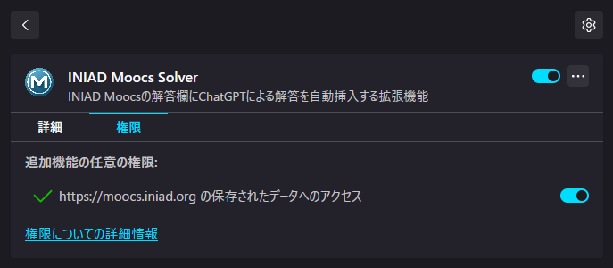
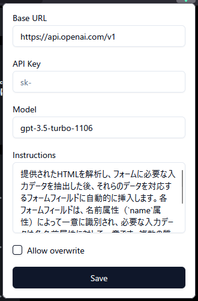

# INIAD Moocs Solver

INIAD Moocs の解答欄に ChatGPT による解答を自動挿入する拡張機能

## インストール

- [Chrome](https://chromewebstore.google.com/detail/iniad-moocs-solver/maedfbckoippeclhlkkaapglbookaeek)
- [Firefox](https://github.com/yu7400ki/iniad-moocs-solver/releases/tag/v0.0.1)

⚠️ Firefox は、`拡張機能 > INIAD Moocs Solver > 管理 > 権限`より、`https://moocs.iniad.org の保存されたデータへのアクセス`を有効にする必要があります。

## 使い方

`提出`ボタンの隣に`ChatGPT`ボタンが追加されます。

出席課題のような、問題文がフォーム部分で完結する問題に対して効果を発揮しますが、それ以外の場合には対応していません。

また自動入力が可能なフォームフィールドは、`input`、`textarea`、`select`のみです。

## 設定

| 項目              | 説明                     | 規定値                                                                                                                                                                                                                                                                                                             |
| ----------------- | ------------------------ | ------------------------------------------------------------------------------------------------------------------------------------------------------------------------------------------------------------------------------------------------------------------------------------------------------------------ |
| `Base URL`        | 使用する API             | `https://api.openai.com/v1`                                                                                                                                                                                                                                                                                        |
| `API Key`         | 使用する API の API Key  |                                                                                                                                                                                                                                                                                                                    |
| `Model`           | 使用するモデル           | `gpt-4o`                                                                                                                                                                                                                                                                                                           |
| `Instructions`    | システムプロンプト       | `` 提供されたHTMLを解析し、フォームに必要な入力データを抽出した後、それらのデータを対応するフォームフィールドに自動的に挿入します。各フォームフィールドは、名前属性（`name`属性）によって一意に識別され、必要な入力データは各名前属性に対して一意です。複数の質問や問題が存在する場合を考慮する必要があります。 `` |
| `Allow overwrite` | 既存の解答を上書きするか | `true`                                                                                                                                                                                                                                                                                                             |

### 注意事項

#### 使用可能なモデル

使用するモデルは`parallel function calls`に対応したモデルである必要があります。

詳しくは[ドキュメント](https://platform.openai.com/docs/guides/function-calling/supported-models)を参照してください。

#### INIAD OpenAI API の使用

INIAD OpenAI API(`https://api.openai.iniad.org/api/v1`)は[CORS](https://developer.mozilla.org/ja/docs/Web/HTTP/CORS)によりアクセスが制限されています。
代わりにプロキシサーバー(`https://proxy-iniad-openai.yu7400ki.workers.dev/api/v1`)を使用することでこの問題を回避できます。プロキシサーバーのソースコードは[yu7400ki/proxy-iniad-openai](https://github.com/yu7400ki/proxy-iniad-openai)で公開されています。

## License

MIT
